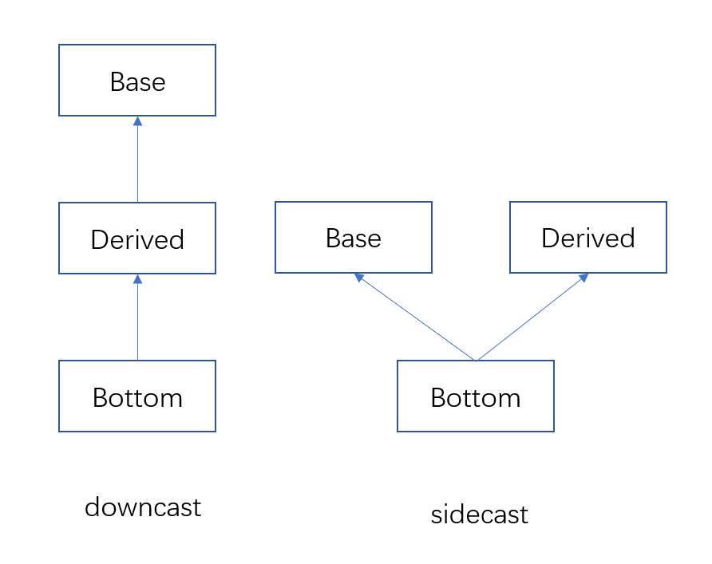

### trailing return type with `auto` and `decltype`
除了更简洁的变量定义和绑定外，`auto`还可以用于trailing return type，其形式如下：

int add(int a, int b);
auto add(int a, int b) -> int;
auto add(int a, int b) -> decltype(a + b);

直观上看，后一种写法并没有什么优势，但我在写bustub的新Project时却遇到了这样的警告：“CLANG-TIDY - MODERNIZE-USE-TRAILING-RETURN-TYPE”，意为trailing return type应用尽用。学习后发现trailing return type有优势如下：
#### Reduce template parameter
考虑如下代码片段:

class Foo {
public:
    int makeValue() {
        return 233;
    }
};

class Bar {
public:
    double makeValue() {
        return 3.14;
    }
};

template<typename ObjT, typename RetT>
RetT make(ObjT& obj) {
    return obj.makeValue();
}

Foo foo;
Bar bar;
cout << make<Foo, int>(foo) << endl;
cout << make<Bar, double>(bar) << endl;
}

用trailing return type改写后，我们可以省去一个模板参数，并且调用时能自动推断模板参数：

template<typename ObjT>
auto make(ObjT& obj) -> decltype(obj.makeValue()) {
    return obj.makeValue();
}

Foo foo;
Bar bar;
cout << make(foo) << endl;
cout << make(bar) << endl;

这里是用了`decltype`在编译期解析一个表达式的类型。
#### Nested name
假设我们有一个类`Game`，并在类内定义了枚举类型`Device`，有一个方法获取该游戏支持的平台：

class Game {
public:
	enum Device {MobilePhone, PC, PS, NS, Xbox};
	vector<Device> getSupportedDeivces();
private:
	vector<Device> devices;
}

传统的写法，我们在`.cpp`文件中实现该方法时，需要这样写：

Game::Device Game::getSupportedDevice() {
	return devices;
}

将类名重复了两遍。现在我们可以这样：

auto Game::getSupportedDevice() -> Device {
	return devices;
}

这是因为在解析到返回值时，编译器已经知道了这个实现是在`Game`命名空间中。
#### 参考资料
https://www.cprogramming.com/c++11/c++11-auto-decltype-return-value-after-function.html

### RAII的实例
C++内部为锁和堆内存提供了RAII类，这里简要介绍其用法。
#### 锁
* 对于普通的互斥锁，如`std::mutex`，应使用`std::scoped_lock`或`std::lock_guard`，前者能对应若干个锁对象而后者只能对应一个，并且前者内置了死锁避免算法，在新的代码中直接用前者即可；
* 对于读写锁，如`std::shared_mutex`，上读锁使用`std::shared_lock`，上写锁使用`std::unique_lock`；
#### 堆内存
智能指针(smart pointer)就是堆内存的RAII对象。若干个`std::shared_ptr`通过引用计数共享内存的所有权，引用计数归零后，堆内存会被释放；`std:unique_ptr`独占堆内存的所有权，该对象被析构或重新赋值时释放堆内存。
#### 参考
https://en.cppreference.com/w/cpp/language/raii

### std::forward
简单来讲，
* `std::move`不管其参数是左值还是右值都会将其cast为右值，是unconditional cast；
* `std::forward`则会根据其参数的**本来面目**，是左值就返回左值，是右值就返回右值，是conditional cast；
我们结合下面这段代码理解：

#include <iostream>
#include <string>
#include <utility>

void overloaded_function(std::string& param) {
  std::cout << "std::string& version" << std::endl;
}
void overloaded_function(std::string&& param) {
  std::cout << "std::string&& version" << std::endl;
}

template<typename T>
void pass_through(T&& param) {
    // overloaded_function(param);
	// overloaded_function(std::move(param));
    overloaded_function(std::forward<T>(param));
}

int main() {
  std::string pes;
  pass_through(pes);
  pass_through(std::move(pes));
}

在main函数中，我们分别以左值和右值的形式调用了两次`pass_through`函数；但是在`pass_though`内部，变量`param`绝对是一个如假包换的左值（有名字、可取地址），因此我们无法实现完美转发（将其以原本的形式传给下一个函数），所以要用`std::forward`，他能解析传入的参数原本是左值还是右值，并将`param`cast回原本的形式。

#### 参考
* https://coolisen.github.io/an-effective-c-11-14-sampler.html
* https://stackoverflow.com/questions/3582001/what-are-the-main-purposes-of-stdforward-and-which-problems-does-it-solve

### 各种cast
#### reinterpret_cast
允许把一个指针转换为任意其他指针类型，允许指针类型和整型互相转换；
#### const_cast
能把指针或引用的`const` 等限定符去掉；
#### static_cast
1. `static_cast`也能把基类指针转换为导出类的指针，但是不会做运行时检查，因此是危险的；
2. `static_cast`应用于整型与枚举类型、浮点数的转换；
#### dynamic_cast
`dynamic_cast`可用于指针，也可用于引用，为了方便描述，这里仅描述指针；`dynamic_cast`有很多功能，这里仅描述其独有功能：
先定义概念：多态类型（[polymorphic type](https://en.cppreference.com/w/cpp/language/object#Polymorphic_objects "cpp/language/object")）：声明或继承了至少一个虚函数的类型称为多态类型；

dynamic_cast< type-id >( expression )

1. 若expression是指向多态对象的指针，type-id是`void*`，那么返回的结果是expression指向的most derived object;
2. 若expression是多态对象Base的指针，type-id是类型Derived：
	1. 若expression的most derived object（记为Bottom），有且仅有一个Derived作为public base，且expression正指向这个Derived对象，返回Derived对象的指针，称为downcast;
	2. 若Bottom是expression的子类，也是Derived的子类，返回指向Derived对象的指针，称为sidecast；
	3. 无法转换，返回`nullptr`；

#### 参考
1. https://learn.microsoft.com/en-us/cpp/cpp/casting-operators?view=msvc-170
2. https://en.cppreference.com/w/cpp/language/dynamic_cast
